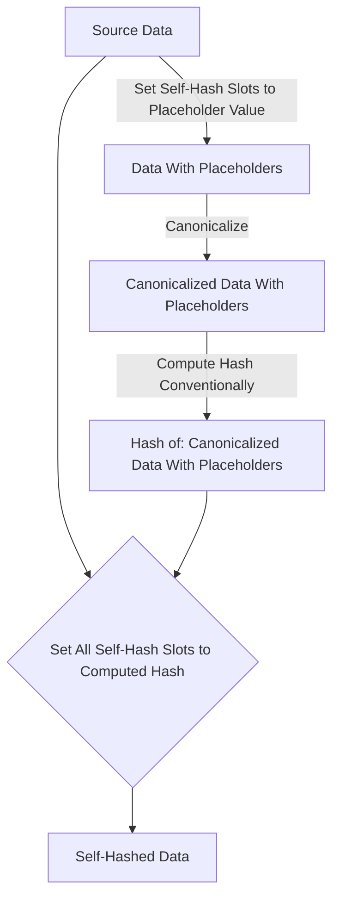
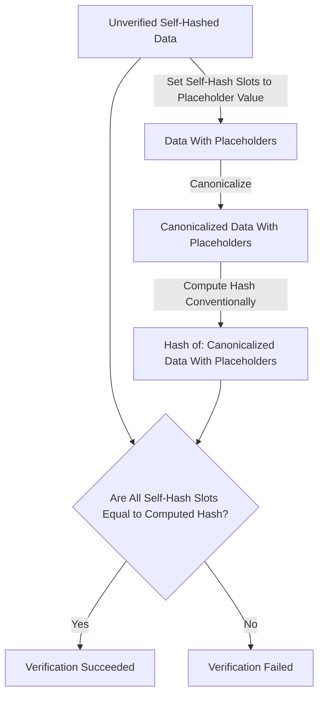

`did:webplus` Method Specification
==================

**Specification Status:** Draft V0.1

**Latest Draft:**
  [https://identity.foundation/spec-up](https://identity.foundation/spec-up)

Authors:
- Victor Dods ([LedgerDomain](https://ledgerdomain.com/))
- Alex Colgan ([LedgerDomain](https://ledgerdomain.com/))

Editors:
~ [Juan Caballero](https://github.com/bumblefudge/)

Participate:
~ [GitHub repo](https://github.com/learningproof/did-webplus-spec)
~ [File a bug](https://github.com/learningproof/did-webplus-spec/issues)
~ [Commit history](https://github.com/learningproof/did-webplus-spec/commits/master)

------------------------------------

## Abstract

`did:webplus` extends `did:web` in ways that provide:

* Verifiable history for each DID
  * self-contained JWT-based cryptography library for generating and verifying these chains of DID documents
  * precise, reliable, and scalable historical resolution for audit-trail use-cases, whether over the web to the hosting server or from trusted caches
* Various additional levels of verifiability beyond did:web's guarantees, which can be achieved via multiple different architecture (trusted resolver, witness network, etc)
* Cost-efficient, scalable "VDR Server" (multi-user, backwards-compatible `did:web` server)
  * Reference implementation available in Rust
* Full backwards-compatibility and fallback to `did:web` functionality (simply replace `webplus` with `web`!)

## Overview

The `did:web` method makes straightforward use of familiar tools across a wide range of use cases. However, heavily regulated ecosystems such as the pharmaceutical supply chain demand additional guarantees of immutability and auditability, including seamless key rotation and a key usage history. `did:webplus` is a proposed fit-for-purpose DID method for use within the pharma supply chain credentialing community, with an eye towards releasing it into the wild for those communities that are similarly situated.

### Terminology

Note that some terms and acronyms from the DID core specification are extended here to mean slightly different things in this context.

[[def: DID Controller, controller]]

~ (Controller): A/the DID controller is an entity capable of making valid changes to a DID document, represented by a public key; by default, a DID's only controller is its subject, but update capabilities can be delegated to devices, "restore keys", etc. Concretely, these keys are listed in the `capabilityInvocation` verification relationship in the DID document. For a DID update to be valid, the new DID document must be validly self-signed, and the `selfSignatureVerifier` field must correspond to one of the keys listed in the latest existing DID document's `capabilityInvocation` field.

[[def: DID Resolver, Resolver]]

~ A DID resolver is the actor that translates a DID URL into a DID document through a "resolution" process. As with `did:web`, this involves translating the DID into a specific URL (or set of URLs) that can be used to fetch the current or any historical DID document(s). Unlike `did:web`, however, resolution is assumed to be a little more active, in that resolution without a cache or trust requires recursive resolution through all backlinks to verify the method-specific identifier against the initial DID Document.

[[def: Verifiable Data Gateway, VDG]]

~ (VDG): A gateway works as a DID resolver "plus", in that it can not only return a current DID document and resolution data but also historical DID documents and additional metadata. The concept could be extended to translate between and abstract over additional DID methods, wherever equivalent historical verifiability, metadata, and semantics are achievable. For advanced capabilities such as Content Delivery Network (CDN)-style distributing caching, see the [Architectural Variations](#architectural-variations) appendix.

[[def: Verifiable Data Registrar, VDR]]

~ (VDR): While the original `did:web` specification essentially treats each HTTP server as its own "verifiable data registry" (as defined in the DID core specification), `did:webplus` refers to the hosting server as a "verifiable data **registrar**", facilitating updates and deletions cryptographically rather than simply being a publication medium.

[[def: Verifying Party, Verifier]]

~ (Verifier): A Verifying Party can verify a digitally signed artifact by resolving the DID of the signer to obtain and use the appropriate public key for signature verification.
A Verifying Party will use a [[ref: DID Resolver]] to resolve the DID. They may use a Full DID Resolver or a Thin DID Resolver, depending on their needs (see [Architectural Variations](#architectural-variations) appendix for details).

## Specification

### DID Scheme

The scheme is `webplus`; note that ANY valid `did:webplus` URL (without query parameters or matrix parameters) is a valid `did:web` URL, which can be resolved as such by simply removing the `plus`.

### Method-Specific Identifiers

The persistent identifier for each DID is the "self-hash" (see [Create](#create) section below) of the initial DID Document.
This identifier remains unchanged across all updates and deactivation.
Resolving the DID with no DID path will always return the current DID document, as will
`did:webplus:{permanent identifier}:{current versionId}:{self-hash of current DID document}`

### Resolution Mechanics and DID Paths

Resolving a DID without query parameters should return that DID's latest DID document. In order to determine the latest DID document, the resolver MUST query the VDR whose domain hosting the DID's microledger, which is the origin for that DID's microledger, and therefore the authority on which DID document is the latest.

#### DID Path to URL mapping

The DID-to-resolution-URL translation rules for the latest DID document are the same as those for did:web, for example:

```bash
did:webplus:example.com:EjXivDidxAi2kETdFw1o36-jZUkYkxg0ayMhSBjODAgQ -> https://example.com/EjXivDidxAi2kETdFw1o36-jZUkYkxg0ayMhSBjODAgQ/did.json
did:webplus:example.com:path-component:EjXivDidxAi2kETdFw1o36-jZUkYkxg0ayMhSBjODAgQ -> https://example.com/path-component/EjXivDidxAi2kETdFw1o36-jZUkYkxg0ayMhSBjODAgQ/did.json
did:webplus:example.com%3A3000:EjXivDidxAi2kETdFw1o36-jZUkYkxg0ayMhSBjODAgQ -> https://example.com:3000/EjXivDidxAi2kETdFw1o36-jZUkYkxg0ayMhSBjODAgQ/did.json
did:webplus:example.com%3A3000:path-component:EjXivDidxAi2kETdFw1o36-jZUkYkxg0ayMhSBjODAgQ -> https://example.com:3000/path-component/EjXivDidxAi2kETdFw1o36-jZUkYkxg0ayMhSBjODAgQ/did.json

did:webplus:localhost:EjXivDidxAi2kETdFw1o36-jZUkYkxg0ayMhSBjODAgQ -> http://localhost/EjXivDidxAi2kETdFw1o36-jZUkYkxg0ayMhSBjODAgQ/did.json
did:webplus:localhost:path-component:EjXivDidxAi2kETdFw1o36-jZUkYkxg0ayMhSBjODAgQ -> http://localhost/path-component/EjXivDidxAi2kETdFw1o36-jZUkYkxg0ayMhSBjODAgQ/did.json
did:webplus:localhost%3A3000:EjXivDidxAi2kETdFw1o36-jZUkYkxg0ayMhSBjODAgQ -> http://localhost:3000/EjXivDidxAi2kETdFw1o36-jZUkYkxg0ayMhSBjODAgQ/did.json
did:webplus:localhost%3A3000:path-component:EjXivDidxAi2kETdFw1o36-jZUkYkxg0ayMhSBjODAgQ -> http://localhost:3000/path-component/EjXivDidxAi2kETdFw1o36-jZUkYkxg0ayMhSBjODAgQ/did.json
```

Note that `/.well-known/` URLs are not used, as the self-hash of the initial DID document is used as the DID string.

##### TODO - partial version-specific paths possible?

can you request

`did:webplus:example.com:EjXivDidxAi2kETdFw1o36-jZUkYkxg0ayMhSBjODAgQ:2`

or

`did:webplus:example.com:EjXivDidxAi2kETdFw1o36-jZUkYkxg0ayMhSBjODAgQ:EgqvDOcj4HItWDVij-yHj0GtBPnEofatHT2xuoVD7tMY`

or ONLY 

`did:webplus:example.com:EjXivDidxAi2kETdFw1o36-jZUkYkxg0ayMhSBjODAgQ:2:EgqvDOcj4HItWDVij-yHj0GtBPnEofatHT2xuoVD7tMY`

?  If there are any rules for the VDR hoster (like, should the server 303 or 307 or otherwise forward from 

`/2/` to 

`/2/EgqvDOcj4HItWDVij-yHj0GtBPnEofatHT2xuoVD7tMY` ?)

#### TODO - Query Parameters

??? not sure how this works with static servers like gitpages, unless you optionally make [tiny] dynamic servers translate `version=` or `versionId=` into the above?

### DID Fragments

DID fragments are only used to refer to specific keys, defined in the `verificationMethods` array where each key contains a full DID+fragment as its `id`, and with purposes mapped to arrays of 0 or more keys by relative fragments.

Resolvers MUST dereference specific verificationMethod objects by absolute references (i.e. DID+key fragment).
They MUST also dereference purpose fragments (i.e. DID+`#authentication`) to the keys they map to.

### DID Document Core Properties

The following are core properties in any `did:webplus`; additional properties MAY be added, but no interoperability is guaranteed, and the following property names MUST be reserved.

-   `id`: MUST be a valid `did:webplus` DID with no query parameters or fragment.
-   `selfHash`: MUST be a valid self-hash in the [KERI hash encoding](#self-hash-encoding). See [self-hashing appendix](#self-hash-algorithm) for specifics on the self-hash generation and verification process.
-   `selfSignature`: MUST be a valid self-signature in the [KERI signature encoding](TODO-link-me-to-appropriate-section).  See [self-signing](#self-signing) for specific relationships between `selfSignature`, `selfSignatureVerifier`, and root and/or previous DID documents.
-   `selfSignatureVerifier`: MUST be a valid public key in the [KERI verifier encoding](TODO-link-me-to-appropriate-section).
-   `prevDIDDocumentSelfHash`: MUST be `null` or a valid self-hash in the [KERI hash encoding](TODO-link-me-to-appropriate-section).
-   `validFrom`: MUST be a valid [RFC 3339](https://www.rfc-editor.org/rfc/rfc3339) timestamp.
-   `versionId`: MUST be an unsigned integer.
-   `verificationMethod`: MUST be an array of [verification methods](TODO-link-me-to-appropriate-section), each of whose key id (the fragment identifying the specific key) MUST be equal to the KERI-encoding of the key.  This achieves two things:
    -   It allows for the key to have a canonical key id.
    -   It allows for the public key to be read out of a DID resource URI so that use of the public key can be done in parallel with the DID resolution process.  The DID resolution process MUST also be performed in order to establish that the identified key is indeed allowed for the relevant key purpose (authentication, assertionMethod, etc).
-   Fields for [Verification Relationships](https://www.w3.org/TR/did-1.1/#verification-relationships)
    -   [`authentication`](https://www.w3.org/TR/did-1.1/#authentication)
    -   [`assertionMethod`](https://www.w3.org/TR/did-1.1/#assertion)
    -   [`keyAgreement`](https://www.w3.org/TR/did-1.1/#key-agreement)
    -   [`capabilityInvocation`](https://www.w3.org/TR/did-1.1/#capability-invocation)
    -   [`capabilityDelegation`](https://www.w3.org/TR/did-1.1/#capability-delegation)

NOTE: The use of KERI-encoded data (e.g. public keys, hashes, signatures) is likely to be changed in the future to use multiformat-based encoding, as it is more standardized, supports more hash/key/signature types, and is more broadly supported.

There are additional constraints that depend on if a DID document is a root DID document or a non-root DID document.

### DID Operations

#### Create

The first DID document in the microledger, called the root DID document, contains a self-hash which forms part of the DID itself. This binds the DID to the content of its root DID document, and prevents alterations to the root DID document.

Generating a root DID document requires the following steps:

1. The root DID document MUST have its `versionId` field set to 0.
1. The root DID document's `prevDIDDocumentSelfHash` field MUST be omitted to indicate that there is no previous DID document.
1. The root DID document's `selfSignatureVerifier` field must correspond to one of the public keys listed in the `capabilityInvocation` field of the root DID document itself. This field defines which keys are authorized to update this DID's DID document; in the case of the root DID document, it establishes an initial self-consistency for that authority (see last step).
1. All other mandatory fields MUST be set (see [core properties](#did-document-core-properties) ).
1. Self-hash the document (see [Self-hash Algorithm](#self-hash-algorithm) below) and self-sign the document (see [Self-sign Algorithm](#self-sign-algorithm below)).
1. POST signed DID document to hosting server, which after verifying hosts it at the appropriate unauthenticated URL (see [DID path to URL mapping section](#did-path-to-url-mapping)).

#### Resolution

1. Convert complete DID URL to URL to request (see [DID path to URL mapping section](#did-path-to-url-mapping)).
1. GET did document (no authentication needed)

Specific versions of the DID document are addressable by `versionId` or `selfHash` query parameters:
-   To resolve the DID document with `selfHash` value `EgqvDOcj4HItWDVij-yHj0GtBPnEofatHT2xuoVD7tMY`, the URL is `https://example.com/EjXivDidxAi2kETdFw1o36-jZUkYkxg0ayMhSBjODAgQ/did/selfHash/EgqvDOcj4HItWDVij-yHj0GtBPnEofatHT2xuoVD7tMY.json`
-   To resolve the DID document with `versionId` value `1`, the URL is `https://example.com/EjXivDidxAi2kETdFw1o36-jZUkYkxg0ayMhSBjODAgQ/did/versionId/1.json`

##### Levels of Verification and Supplemental Trust

//todo

#### Update

A DID controller can update a DID by forming an updated DID document with appropriate relationships to the previous DID document and appropriate public keys, [self-signing](#self-signing) and [self-hashing](#self-hashed-data) the DID document, and then `HTTP PUT`-ing the DID document to the resolution URL for the DID.

Upon receipt of a valid and appropriate-signed DID document, the controller of the current DID document MUST host an identical copy of the new DID document at both the primary versionHash path AND the alternate versionId path (see [resolution](#resolution) above).
It must also overwrite the current `did:web` fallback DID document with the new DID document to successfully resolve the corresponding `did:web` document post-update.

#### Deactivate

//Todo - didn't see any reference in the original spec

### DID Authorization

At minimum, each DID document contains at least one public key at inception, and updates to it can be authorized only by a signature verifying against a key in that authorization key set.
Additional controllers (in the form of additional public keys) can be added at inception or by any valid update; see the update section above.

//TODO - Can an update reducing that number to 0 be accepted? If so, what conditions must be met for it to be accepted, i.e., must the same update change "type" to "Tombstone", etc? (silly example but worth planning carefully)? Make sure this section matches the Deactivate section above

### Example 

### Self-Hash Algorithm

In `did:webplus`, hashes are represented as ASCII strings as in [KERI](https://github.com/decentralized-identity/keri/blob/master/kids/kid0001.md#derivation-codes), where the first character gives the hash function and the remainder of the string is the base64url-encoding of the hash value.  In particular, the Blake3 hash function is represented using the character `E`, and the 256-bit hash value is represented as a 43-digit base64url-encoded string.  For example:

    EjXivDidxAi2kETdFw1o36-jZUkYkxg0ayMhSBjODAgQ

The placeholder value for the Blake3 hash function is

    EAAAAAAAAAAAAAAAAAAAAAAAAAAAAAAAAAAAAAAAAAAA

noting that 43 `A` characters is the base64url-encoding of 256 bits of 0.

//TODO is the above up to date? if so, as concisely as possible replace it with an accurate overview of how to format/express the hash and an example of a zero-ed-out value.

Abstractly, the process is:



##### Self-Hashed Data Verification

Abstractly, the process is:



#### Self-Hash Encoding

//TODO: summarize KERI and/or multibase encoding in 3 sentences max and add normref below

### Self-Sign Algorithm

//TODO: above, it still says "See [self-signing](#self-signing) for specific relationships between `selfSignature`, `selfSignatureVerifier`, and root and/or previous DID documents."

## Appendices

### Weaknesses of DID:WEB

The ways in which a malicious HTTP server can falsify or distort DID documents in `did:web` are inherited by the basic configuration of `did:webplus`, but the latter has mitigations which can be provided as needed for different use-cases (see [Architectural Variations](#architectural-variations) below).

#### DID Forks

#### Deletion 

### Architectural Variations

### Security Considerations

### Privacy Considerations

#### Recommendations for Verifiable Credential usage

#### Full DID Resolver

#### Thin DID Resolver + VDG